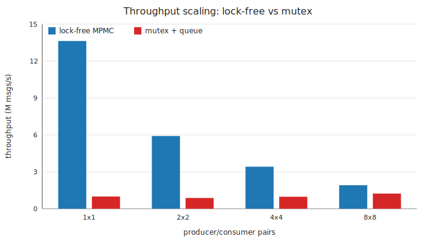

# lockfree-spsc

A from-scratch family of **bounded lock-free queues** in modern C++ — SPSC,
MPSC, and MPMC — plus a **cross-process shared-memory transport** and a
**latency microscope** that attributes tail-latency spikes to their root cause.
Built around measuring the *distribution* honestly.

See [`docs/design.md`](docs/design.md) for the algorithms and memory-ordering
reasoning.

> **Scope & data note:** this is a personal project. It contains **no**
> proprietary, internal, employer, customer, consumer, or telemetry data of any
> kind. Every benchmark uses **synthetic data generated in-process** (sequence
> numbers and timestamps). Dependencies are the C++ standard library only.

---

## Why this exists

Most "fast queue" projects report an *average* and stop. Real high-performance
systems care about the **tail** — the p99 / p99.9 latency and *why* it spikes.
This project measures the distribution honestly and then explains it.

## What's inside

| Component | Header | Concurrency |
|---|---|---|
| `SpscQueue<T>` | `lfq/spsc_queue.hpp` | 1 producer, 1 consumer (wait-free) |
| `MpscQueue<T>` | `lfq/mpsc_queue.hpp` | N producers, 1 consumer (lock-free) |
| `MpmcQueue<T>` | `lfq/mpmc_queue.hpp` | N producers, M consumers (Vyukov bounded) |
| `ShmSpscChannel<T>` | `lfq/shm_transport.hpp` | cross-process over shared memory |
| `Histogram` / timing | `lfq/histogram.hpp`, `lfq/timing.hpp` | latency measurement primitives |
| latency microscope | `tools/latency_scope/scope.cpp` | tail-latency attribution |

Common design points: bounded ring buffers, power-of-two capacity with bitmask
indexing, acquire/release publication so a consumer never sees a half-written
element, and cache-line isolation to avoid false sharing. Header-only, standard
C++20; OS-specific bits (thread pinning, shared memory) are isolated and
feature-guarded.

```cpp
#include "lfq/spsc_queue.hpp"

lfq::SpscQueue<int> q(1024);   // capacity rounded up to a power of two
q.try_push(42);                // producer thread; false if full
int x;
q.try_pop(x);                  // consumer thread; false if empty
```

## Results

Measured locally on a general-purpose developer machine (specs intentionally
omitted). **These numbers are illustrative** — the benchmark
was not run on an isolated box. Reproduce on your own hardware for numbers you
can trust.

| Metric | Value |
|---|---|
| SPSC throughput | **~80 M msgs/s** (~12 ns/msg) |
| SPSC latency p50 | ~290 ns |
| Lock-free MPMC vs mutex+queue | **~7.5× faster** (2P/2C) |
| Differential validation | **22.4 M randomized ops, 0 divergences** vs `std::queue` oracle |
| Concurrency correctness | SPSC/MPSC/MPMC conservation tests, 0 failures |

**Reading the tail honestly:** p50 is low, but the p99.9+ tail reaches the
*milliseconds* on a shared, non-isolated machine — the OS scheduler and
background work produce large, rare stalls. The latency microscope exists to
**attribute** that tail (on Linux it correlates spikes with involuntary context
switches).

### Charts

`bench_csv` emits results as CSV and `tools/plot/plot.py` (Python standard
library only — nothing to install) renders them to SVG:

```bash
./build/bench_csv docs/results          # writes scaling.csv, latency_cdf.csv
python tools/plot/plot.py docs/results   # writes scaling.svg, latency_cdf.svg
```



Throughput of the lock-free MPMC queue versus a mutex-guarded `std::queue` as the
producer/consumer count grows. The lock-free queue wins at every point, and the
*shape* — throughput falling under contention — is the interesting part to
explain (cache-line ping-pong on the shared indices). The latency CDF is produced
by the same tool and uploaded as a CI artifact, where a Linux runner gives a
finer timer than this emulated dev box. Absolute numbers are illustrative;
reproduce them yourself.

## Build & run

**Windows (MSVC), from the repo root:**
```powershell
.\build.ps1 -Run
```

**Linux / macOS (CMake):**
```bash
cmake -S . -B build -DCMAKE_BUILD_TYPE=Release
cmake --build build
ctest --test-dir build --output-on-failure   # all tests
./build/bench_spsc                            # throughput + latency
./build/bench_compare                         # lock-free vs mutex
./build/scope                                 # latency microscope
```

**Sanitizers (Linux):**
```bash
cmake -S . -B build -DCMAKE_BUILD_TYPE=Debug -DLFQ_SANITIZE=thread
cmake --build build && ctest --test-dir build --output-on-failure
```
CI runs the tests plus an ASan/TSan/UBSan matrix on every push.

## Layout

```
include/lfq/          spsc / mpsc / mpmc queues, shm transport, timing, histogram
tests/                correctness, conservation, and differential-vs-oracle tests
bench/                throughput + latency benchmark, lock-free-vs-mutex compare, CSV emitter
tools/latency_scope/  tail-latency attribution tool
tools/plot/           dependency-free CSV -> SVG chart generator (stdlib Python)
docs/design.md        algorithms + memory-ordering reasoning
docs/results/         benchmark CSVs and generated charts
CMakeLists.txt        Linux/CI build   ·   build.ps1  Windows/MSVC build
PLAN.md               the full end-state plan (five-pillar target)
```

## Concepts this demonstrates

Lock-free / wait-free design · the C++ memory model (acquire / release) · the
Vyukov bounded MPMC algorithm and per-slot sequence counters · false sharing and
cache-line isolation · ring buffers with power-of-two masking · cross-process
shared memory (`mmap` / `CreateFileMapping`) · tail-latency thinking (p50 →
p99.9) and its attribution · differential testing against a reference oracle ·
disciplined benchmarking (warm-up, thread pinning, distribution over average).

## License

MIT — see [`LICENSE`](LICENSE).
